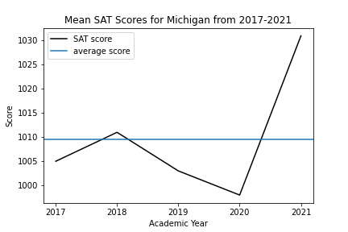
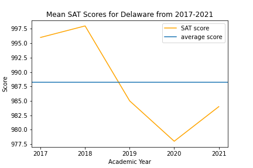

#  Project 1: Standardized Test Analysis

### Problem Statement

This project aims to find trends in the SAT scores to determine if Covid-19 has any impact on SAT performances and if colleges should continue to use SAT as an indicator for college readiness. 

### Background

The SAT and ACT are standardized tests that many colleges and universities in the United States require for their admissions process. This score is used along with other materials such as grade point average (GPA) and essay responses to determine whether or not a potential student will be accepted to the university.

The SAT has two sections of the test: Evidence-Based Reading and Writing and Math ([*source*](https://www.princetonreview.com/college/sat-sections)). The ACT has 4 sections: English, Mathematics, Reading, and Science, with an additional optional writing section ([*source*](https://www.act.org/content/act/en/products-and-services/the-act/scores/understanding-your-scores.html)). They have different score ranges, which you can read more about on their websites or additional outside sources (a quick Google search will help you understand the scores for each test):
* [SAT](https://collegereadiness.collegeboard.org/sat)
* [ACT](https://www.act.org/content/act/en.html)

Standardized tests have long been a controversial topic for students, administrators, and legislators. Since the 1940's, an increasing number of colleges have been using scores from sudents' performances on tests like the SAT and the ACT as a measure for college readiness and aptitude ([*source*](https://www.minotdailynews.com/news/local-news/2017/04/a-brief-history-of-the-sat-and-act/)). Supporters of these tests argue that these scores can be used as an objective measure to determine college admittance. Opponents of these tests claim that these tests are not accurate measures of students potential or ability and serve as an inequitable barrier to entry.

Due to the impact of Covid-19, an infectious virus that is sister of the SARS virus, schools in the United States of America faced a near-total shutdown starting spring of 2020. For example, all schools in Maryland were orederd by officals to close since March 2020, and through the rest of the 2020 academic year. September 8, 2020, schools in Maryland were only allowed to open virtually, and most schools implemented virtual or hybrid learning. March 1, 2021 is when Maryland Governer Larry Hogan encoraged schools across the state to return students to the classroom. ([*source*](https://www.edweek.org/leadership/map-coronavirus-and-school-closures-in-2019-2020/2020/03))

The quarantine imposed by the government has limited students from going to school in the traditional method. In addition to that, testing centers were also closed, causing a widespread cancellation in testing dates. Thus, many colleges and universities decided to make SAT scores an optional requirement for the 2021 applicants. Some colleges have a longer exemption time, while some remove the testing requirements permanently. ([*read more about this here*](https://www.cnn.com/2020/04/14/us/coronavirus-colleges-sat-act-test-trnd/index.html)).

---

### Datasets
* [`sat_2017.csv`](./data/sat_2017.csv): 2017 SAT scores by State([source](https://blog.collegevine.com/here-are-the-average-sat-scores-by-state/))
* [`sat_2018.csv`](./data/sat_2018.csv): 2018 SAT Scores by State([source](https://blog.collegevine.com/here-are-the-average-sat-scores-by-state/))
* [`sat_2019.csv`](./data/sat_2019.csv): 2019 SAT Scores by State([source](https://blog.prepscholar.com/average-sat-scores-by-state-most-recent))

### Additional Data
College Board: The 2021 SAT Suite of Assessments Annual Reports ([*source*](https://research.collegeboard.org/programs/sat/data/2021-sat-suite-annual-report))
* [`2017_delaware.pdf`](./data/2017_delaware.pds): 2017 SAT Suite of Assessments Annual Report Delaware ([*link*](https://reports.collegeboard.org/pdf/2017-delaware-sat-suite-assessments-annual-report.pdf ))
* [`2018_delaware.pdf`](./data/2018_delaware.pds): 2018 SAT Suite of Assessments Annual Report Delaware ([*link*](https://reports.collegeboard.org/pdf/2018-delaware-sat-suite-assessments-annual-report.pdf ))
* [`2019_delaware.pdf`](./data/2019_delaware.pds): 2019 SAT Suite of Assessments Annual Report Delaware ([*link*](https://reports.collegeboard.org/pdf/2019-delaware-sat-suite-assessments-annual-report.pdf ))
* [`2020_delaware.pdf`](./data/2020_delaware.pds): 2020 SAT Suite of Assessments Annual Report Delaware ([*link*](https://reports.collegeboard.org/pdf/2020-delaware-sat-suite-assessments-annual-report.pdf ))
* [`2021_delaware.pdf`](./data/2021_delaware.pds): 2021 SAT Suite of Assessments Annual Report Delaware ([*link*](https://reports.collegeboard.org/pdf/2021-delaware-sat-suite-assessments-annual-report.pdf ))
* [`2020_connecticut.pdf`](./data/2020_connecticut.pds): 2020 SAT Suite of Assessments Annual Report Connecticut ([*link*](https://reports.collegeboard.org/pdf/2020-connecticut-sat-suite-assessments-annual-report.pdf ))
* [`2021_connecticut.pdf`](./data/2021_connecticut.pds): 2021 SAT Suite of Assessments Annual Report Connecticut ([*link*](https://reports.collegeboard.org/pdf/2021-connecticut-sat-suite-assessments-annual-report.pdf ))
 * [`2020_michigan.pdf`](./data/2020_michigan.pds): 2020 SAT Suite of Assessments Annual Report Michigan ([*link*](https://reports.collegeboard.org/pdf/2020-michigan-sat-suite-assessments-annual-report.pdf ))
  * [`2021_michigan.pdf`](./data/2021_michigan.pds): 2021 SAT Suite of Assessments Annual Report Michigan ([*link*](https://reports.collegeboard.org/pdf/2021-michigan-sat-suite-assessments-annual-report.pdf ))
---

### Data Dictionary

|Feature|Type|Dataset|Description|
|---|---|---|---|
|**state**|*object*|SAT|50 states, federal district, and minor islands| 
|**participation**|*float*|SAT|the percentage of testtakers that took SAT|
|**readingwriting**|*int*|SAT|mean evidence-based reading and writing score (200-800)|
|**math**|*int*|SAT| math score (200-800)|
|**total**|*int*|SAT|combined score of reading, writing, and math (400-1600)|

### Data description and visualization
- The following bar chart demonstrated that Connecticut, Delaware, and Michigan had 100% SAT participation for 2017, 2018, and 2019. 

- The following line plot demonstrated that the average SAT score for students of Connecticut dropped for the year 2020.

- The following line plot demonstrated that the average SAT score for students of Michigan dropped for the year of 2020.

- The following line plot demonstrated a more significant decrease in the SAT performances for the year 2020.

### Conclusions and Recommendations
Through investigating the trends in the SAT scores across the three states that have 100% SAT participation. The sudden decrease in the SAT performances for students in the 2020 academic year, and the increase in that performances for students in the 2021 academic year, suggested that SAT scores are negatively impacted by the Covid-19. 

I recommend that colleges continue to utilize SAT scores as a standard for college application due to the simplicity of the scoring. Also, it can prepare the students for future testings. In addition to SAT, many professions require other standardized tests. For example, the MCAT for medical school application, TEAS for nursing school entrance, DAT for dental school, and GRE for grad school. For professions that don't require more testings, such as data science, you will still have to prepare for future interview questions. Therefore, SAT is your very first step to a successful career in the future.  

### Next Step
I think my model ready for presentation in class, but not perfect for production. While typing up the conclusion, I realized that incorporating some other data, such as the SAT participation of intended college majors, can strengthen my topic. However, due to time constraints, I decided to stick with the current datasets. 

The skills that I practiced and demonstrated in this project will be very helpful to future problems. Data cleaning skills, plotting skills are the fundamentals of data science. I will definitely be applying them to similar problems in the future. 
